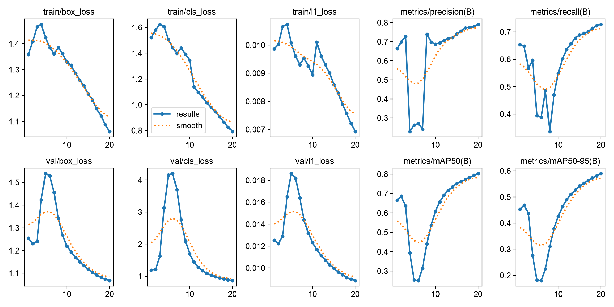
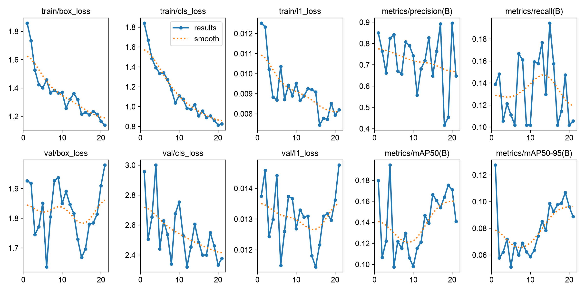
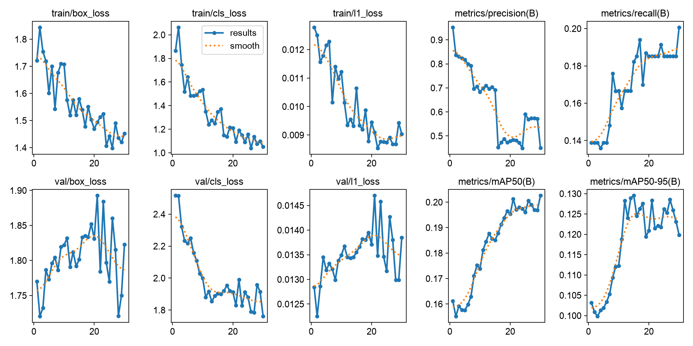
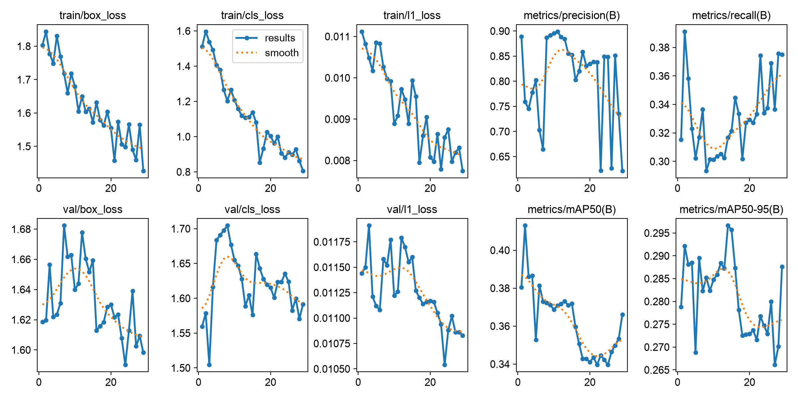

# Detection 학습 결과

AI Hub 기본 모델부터 Galaxy 수정 라벨을 반영한 최종 모델까지의 학습 곡선 및 epoch별 원본 지표입니다.

| 실험 | 학습 기록 | 원본 지표 | 설명 |
|---|---|---|---|
| AI Hub base | [`aihub_base_results.png`](aihub_base_results.png) | [`aihub_base_metrics.csv`](aihub_base_metrics.csv) | AI Hub Detection 데이터 기반 학습, 20 epochs |
| Galaxy v1 | [`galaxy_v1_results.png`](galaxy_v1_results.png) | [`galaxy_v1_metrics.csv`](galaxy_v1_metrics.csv) | 직접 촬영 이미지 1차 추가 학습, 21 epochs |
| Galaxy v3 weighted | [`galaxy_v3_weighted_results.png`](galaxy_v3_weighted_results.png) | [`galaxy_v3_weighted_metrics.csv`](galaxy_v3_weighted_metrics.csv) | 직접 라벨 데이터 비중 강화, 30 epochs |
| Galaxy v4 revised | [`galaxy_v4_revised_results.png`](galaxy_v4_revised_results.png) | [`galaxy_v4_revised_metrics.csv`](galaxy_v4_revised_metrics.csv) | 오탐 검수와 수정 라벨 반영, 29 epochs |

## 학습 곡선

### AI Hub base

### Galaxy v1

### Galaxy v3 weighted

### Galaxy v4 revised

## 최종 외부 평가

- 평가 이미지: Galaxy 직접 촬영 이미지 184장
- 정답 Bounding Box: 163개
- TP / FP / FN: 92 / 24 / 71
- Precision / Recall / F1: 0.793 / 0.564 / 0.659
- 판정 기준: 같은 클래스, IoU 0.50 이상, confidence 0.25

## 해석 주의사항

- PNG와 CSV의 지표는 각 학습 run에 설정된 validation 데이터 기준입니다.
- 최종 외부 평가는 네 실험을 동일 조건으로 비교하기 위해 별도의 Galaxy 184장과 수정 정답 라벨을 사용했습니다.
- 따라서 학습 CSV의 mAP와 최종 외부 평가의 Precision·Recall·F1을 같은 지표로 직접 비교하면 안 됩니다.
- 모델 가중치와 전체 학습 산출물은 저장소에 포함하지 않습니다.
