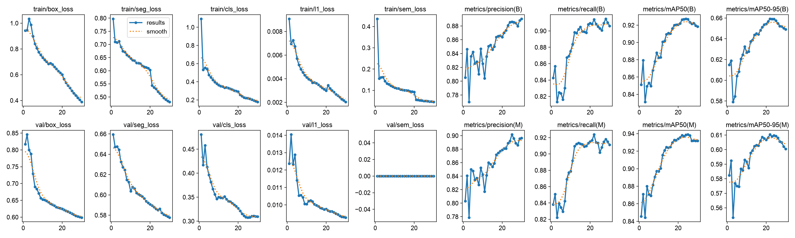
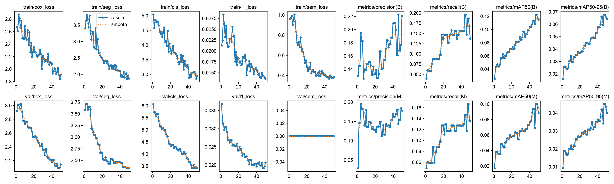
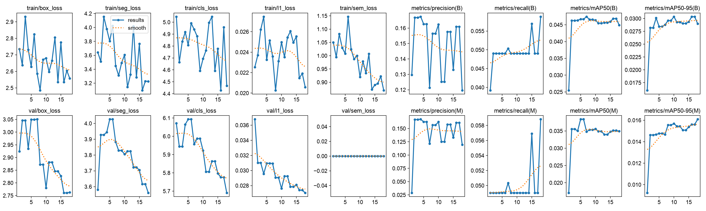

# Segmentation 학습 결과

AI Hub 기반 모델과 Galaxy 수동 라벨 추가 학습 실험의 학습 곡선 및 epoch별 원본 지표입니다.

| 실험 | 학습 기록 | 원본 지표 | 설명 |
|---|---|---|---|
| AI Hub base | [`aihub_base_results.png`](aihub_base_results.png) | [`aihub_base_metrics.csv`](aihub_base_metrics.csv) | AI Hub 50,133장 기반 학습 |
| manual v1 | [`manual_v1_results.png`](manual_v1_results.png) | [`manual_v1_metrics.csv`](manual_v1_metrics.csv) | Galaxy 수동 폴리곤 52장 추가 학습, 50 epochs |
| manual v2 light | [`manual_v2_light_results.png`](manual_v2_light_results.png) | [`manual_v2_light_metrics.csv`](manual_v2_light_metrics.csv) | 수동 데이터 영향을 줄인 실험, 18 epochs에서 조기 종료 |

## 학습 곡선

### AI Hub base

### Galaxy manual v1

### Galaxy manual v2 light

## 해석 주의사항

- 수동 라벨 270개 중 차선이 268개이고 신축이음부는 2개입니다.
- 수동 검증셋만으로 기존 6개 클래스 전체의 성능을 대표할 수 없습니다.
- `manual v1 epoch30.pt`는 최고 단일 지표가 아니라 AI Hub 특성 유지와 실제 촬영 차선 반영 사이의 절충점으로 선택했습니다.
- CSV는 재현과 검토를 위한 Ultralytics 원본 epoch 지표입니다.
